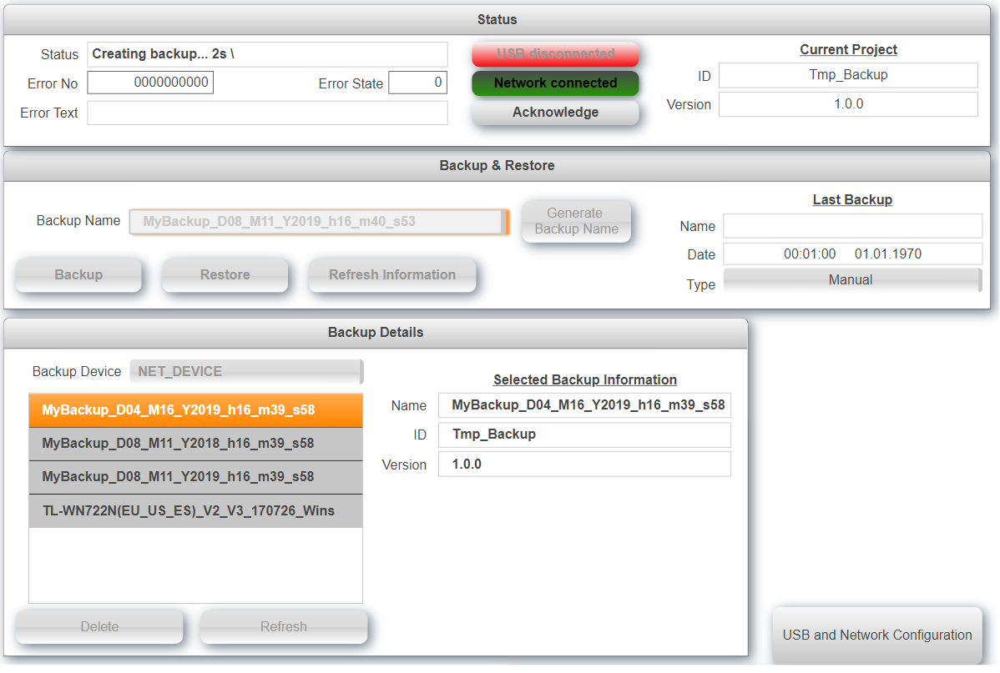

## Table of Contents

-   [Introduction](#Introduction)
-   [Requirements](#Requirements)
-   [Revision History](#Revision-History)

## Introduction

This is a sample project for a software management with mappView. It uses B&R mappBackup to backup and restore the PLC data.

Also see [**How to import the software management into an existing project.**](/Logical/mappBackup/HowToImport.pdf) Download the latest release from [**here.**](../../releases) When upgrading from a previous version make sure to delete the files that were imported before. Detailed information are available in the [**Wiki**](https://github.com/stephan1827/mappView-Backup/wiki).

## Requirements

-   Automation Studio 4.5
-   mappView 5.71
-   mappServices 5.71
-   Automation Runtime B4.53

Recommended task class is #8 with a 10ms cycle time.

## Revision History

#### Version 0.1

-   Initial commit

## Table of Contents

-   [Description](#Description)
-   [Pre Configuration](#Pre-Configuration)
-   [Limitations](#Limitations)
-   [Error numbers](#Errors)
-   [Revision History](#Revision-History)

## Description

The sample consists of two main components. The sample page is used to operate the software management. The task mappBackup_01 drives the software management. The two helper task USBdevice and NETdevice are used to connect to USB sticks and network resource's following functions are currently supported.

-   Create and restore backups
-   Delete backups
-   List backups
-   Generate backup names

Depending on the target device and project size a backup or restore command will take several minutes. The task uses a variable structure to communicate with the outside world that can also be used to interact with other tasks. The structure _Backup_01_ looks as follows:

<table>

  <tr>
    <td width=100>Level 1</td>
    <td>Level 2</td>
    <td>Level Description</td>
  </tr>
  <tr style="font-weight:bold">
    <th>CMD</th>
    <td colspan="3">Used to trigger commands like backup, restore, delete, ... A command is triggered by setting it to true, when the command is finished the task will reset the command. This indicates that the command is finished. Do not change any parameters or set another command until the previous command is finished.</td>
  </tr>
  <tr>
   <td></td>
   <td>Backup</td>
   <td colspan="3">Create a backup</td>
  </tr>
  <tr>
   <td></td>
   <td>Restore</td>
   <td colspan="3">Restore an existing backup</td>
  </tr>
   <tr>
   <td></td>
   <td>Delete</td>
   <td colspan="3">Delete the selected backup</td>
  </tr>
   <tr>
   <td></td>
   <td>GenerateName</td>
   <td colspan="3">Generate backup name by using the default name plus the date and time</td>
   </tr>
    <tr>
    <td></td>
    <td>RefreshInfo</td>
    <td colspan="3">Refresh details for the selected backup</td>
   </tr>
  </tr>
   <tr>
   <td></td>
   <td>RefreshDirectory</td>
   <td colspan="3">Refresh the list of available backups</td>
  </tr>
   <tr>
   <td></td>
   <td>ErrorReset</td>
   <td colspan="3">Resets pending errors</td>
  </tr>
    <th> PAR </th>
    <td colspan="3">Parameters like backup name, file path, ...</td>
  </tr>
      <tr>
   <td></td>
   <td>BackupName</td>
   <td colspan="3">Name of the backup to be created or restored</td>
  </tr>
   <tr>
   <td></td>
   <td>DefaultName</td>
   <td colspan="3">Name used for auto generating backup names</td>
  </tr>
    <tr>
   <td></td>
   <td>DeviceName</td>
   <td colspan="3">Device where the recipe is created or restored. This can be a USB stick or network resource. The user partition is not a valid device since it is part of the backup and restore process.</td>
  </tr>
        <tr>
   <td></td>
   <td>UniqueName</td>
   <td colspan="3">This name is used to create folder in the restore location when the restore command is called. When the PLC reboots after the restore process this folder is used to detect that a restore was completed. When using USB devices for restore the name is not relevant. When using network shares this name should be unique for each PLC that uses the location to restore updates.</td>
  </tr>
    <tr>
   <td></td>
   <td>DeviceList</td>
   <td colspan="3">List of devices where the backups are stored</td>
  </tr>
    <tr>
   <td></td>
   <td>VisuSlotID</td>
   <td colspan="3">Web session that triggered the command. This is used to show the message box only on the client that triggered the command.</td>
  </tr>
  <tr>
   <td></td>
   <td>RecipeDirectory</td>
   <td colspan="3">Folder where the backups are stored. If the folder does not exist it will be created during the init command.</td>
  </tr>
    <tr>
   <td></td>
   <td>MpLink</td>
   <td colspan="3">MpLink from the mappRecipe configuration under the physical view.</td>
  </tr>
      <tr>
   <td></td>
   <td>VisuSlotID</td>
   <td colspan="3">This is the session ID for the current command. This is used to identify where to send response messages.</td>
  </tr>
      <tr>
   <td></td>
   <td>ShowMessageBoxOK</td>
   <td colspan="3">Show message box when backup or restore is finished</td>
  </tr>
  <tr>
<td></td>
<td>ShowMessageBoxError</td>
<td colspan="3">Show message box when error occurs</td>
</tr>
  <tr>
    <th> DAT </th>
    <td colspan="3">Backup list as well as status information</td>
  </tr>
  <tr>
   <td></td>
   <td>CurrentID</td>
   <td colspan="3">ID of the current project</td>
  </tr>
   <td></td>
   <td>CurrentVersion</td>
   <td colspan="3">Version of the current project</td>
  </tr>
  <tr>
   <td></td>
   <td>RequestedName</td>
   <td colspan="3">Name of the selected backup</td>
  </tr>
  <tr>
   <td></td>
   <td>RequestedID</td>
   <td colspan="3">ID of the selected backup</td>
  </tr>
  <tr>
   <td></td>
   <td>RequestedVersion</td>
   <td colspan="3">Version of the selected backup</td>
  </tr>
  <tr>
   <td></td>
   <td>LastName</td>
   <td colspan="3">Name of the last backup</td>
  </tr>
  <tr>
   <td></td>
   <td>LastDate</td>
   <td colspan="3">Date and time of the last backup</td>
  </tr>
  <tr>
   <td></td>
   <td>LastType</td>
   <td colspan="3">Last backup was manual or automatic</td>
  </tr>
  <tr>
   <td></td>
   <td>BackupNames</td>
   <td colspan="3">All directories found at the location. This includes backups or any directory found. To check if a directory is a valid backup select it and check the backup details.</td>
  </tr>
  <tr>
   <td></td>
   <td>BackupNum</td>
   <td colspan="3">Number of backups found</td>
  </tr>
   <tr>
   <td></td>
   <td>Status</td>
   <td colspan="3">Shows the result for the last command</td>
  </tr>
  <tr>
    <th> VIS </th>
    <td colspan="3">Data specific for the visualization.</td>
  <tr>
   <td></td>
   <td>DeviceList</td>
   <td colspan="3">List with all devices formatted as data provider for the mappView listbox</td>
  </tr>
  <tr>
   <td></td>
   <td>BackupNames</td>
   <td colspan="3">List with all backups names formatted as data provider for the mappView listbox</td>
  </tr>
  <tr>
   <td></td>
   <td>EnabledCommand</td>
   <td colspan="3">Used to disable the group boxes while command is active</td>
  </tr>
  <tr>
   <td></td>
   <td>EnabledDelete</td>
   <td colspan="3">Only enable delete if at least one backup exists</td>
  </tr>
  <tr>
   <td></td>
   <td>ShowMessageBoxOK</td>
   <td colspan="3">Show a message box when command was successful</td>
  </tr>
   <tr>
    <td></td>
    <td>ShowMessageBoxError</td>
    <td colspan="3">Show a message box when command was not successful</td>
   </tr>
   <tr>
    <th> ERR </th>
    <td colspan="3">Information about errors</td>
  </tr>
   <tr>
   <td></td>
   <td>No</td>
   <td colspan="3">Error number</td>
  </tr>
  <tr>
   <td></td>
   <td>State</td>
   <td colspan="3">State where the error occurred</td>
  </tr>
  <tr>
   <td></td>
   <td>Text</td>
   <td colspan="3">Error text</td>
  </tr>
</table>

## Pre-Configuration

The following constants located in the package mappBackup under Variables.var can be adjusted if necessary.

| Constant           | Default | Text                                                                                                                 |
| ------------------ | ------- | -------------------------------------------------------------------------------------------------------------------- |
| BACKUP_DEVICE_LIST |         | List of predefined devices for backup and restore.                                                                   |
| BACKUP_LIST_NUM    | 20      | Maximum number of backups that are listed.                                                                           |
| BACKUP_NAME_LENGTH | 100     | Maximum length for a backup name.                                                                                    |
| BACKUP_VIS_LENGTH  | 300     | Make this BACKUP_NAME_LENGTH x 3.                                                                                    |
| BACKUP_DIRECTORY   |         | By default the backups must be in the root of the device. If this is not possible a folder path can be defined here. |

## Limitations

-   For obvious reasons it is not possible to trigger concurrent backups or restore processes from multiple clients at the same time. However, the sample will only show message boxes on the web client that triggered the command.
-   Backup and restore does not work when the target is in simulation mode.

## Error

The sample generates the following list of error messages. All other error numbers are generated from included libraries that can be found in the Automation Studio help.

| No    | Constant                | Text                                            |
| ----- | ----------------------- | ----------------------------------------------- |
| 50000 | ERR_BAC_NAME_IS_EMPTY   | Backup name is empty                            |
| 50001 | ERR_BAC_DEVICE_IS_EMPTY | Device name is empty                            |
| 50010 | ERR_BAC_MAX_NUM         | Backup name already exists                      |
| 50011 | ERR_BAC_NAME_LENGTH     | Backup name length exceeds maximum size         |
| 50020 | ERR_BAC_NAME_EXISTS     | One or more recipe names exceeds maximum length |

## Revision History

#### Version 0.1

First public release
